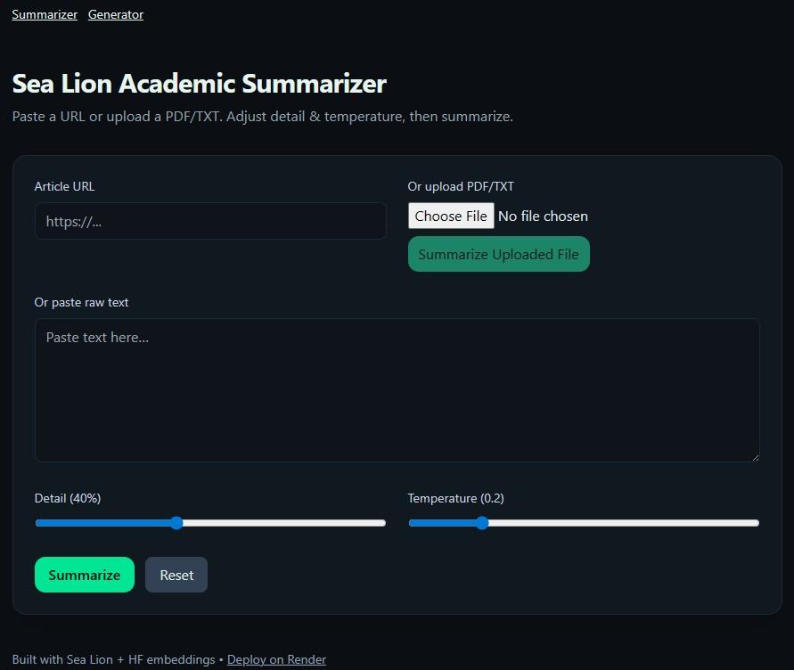
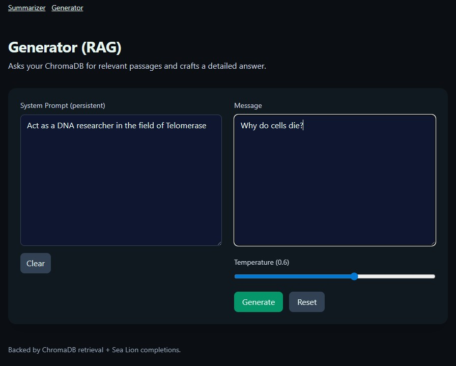

# Summariser and Generator

This application supports two closely related tasks:

1. **Summarise** a URL, PDF/TXT document, or pasted text into a readable study-ready summary.
2. **Generate** follow-up answers that are *grounded* in what you have already summarised or uploaded.

The intended workflow is: **Summarise first**, then use **Generator** to ask targeted questions based on the stored material.

## What you can do with it

### Summariser
- Summarise a public article or report from a URL.
- Upload an academic PDF and extract a structured summary.
- Paste raw text (e.g., lecture notes, report sections) and produce a concise synthesis.

### Generator (grounded Q&A)
- Ask follow-up questions that rely on the passages stored by the Summariser.
- Request a specific structure (e.g., bullet points, a short memo, a comparison table).
- Require citations in the form **[Doc i]** to keep answers anchored to retrieved evidence.

## How to use (recommended workflow)

### Step 1 — Summarise
1. Open **Summariser**.
2. Choose an input method:
   - **URL** for an article or paper page
   - **Upload** for PDF/TXT
   - **Text** for pasted content
3. Adjust:
   - **Detail**: higher values produce longer, more comprehensive summaries.
   - **Temperature**: lower values are typically more literal and factual.
4. Click **Summarise**.
5. Review the result and (optionally) **copy** or **download** it.

The app stores extracted passages to support the next step.

### Step 2 — Ask grounded follow-up questions
1. Open **Generator**.
2. Enter a question related to what you uploaded/summarised.
3. Optional controls:
   - **Retrieval depth**: how many passages are used as evidence.
   - **System prompt**: a persistent instruction that enforces style, structure, and citation discipline.
4. Click **Generate**, then review:
   - the answer
   - the **Sources referenced** list
   - the **Evidence matches** metadata (Advanced)

## Use case example: preparing for a seminar

**Scenario:** You have a 25-page journal article and need to lead a discussion.

1. In **Summariser**, upload the PDF.
2. Set **Detail** to ~60–80 and **Temperature** to 0.1–0.3.
3. In **Generator**, ask:
   - “What is the central research question and the main findings? Use bullet points and cite as [Doc i].”
   - “List assumptions and threats to validity. Then propose two follow-up studies.”
   - “Summarise the method in 8–10 steps. Note data limitations and potential confounds.”

This typically yields a usable briefing plus a set of evidence-based prompts you can bring into the seminar.

## Managing stored material

The Summariser stores extracted passages to enable grounded follow-up questions. If you want to remove stored material:

- Open **Summariser → Advanced → Knowledge base management**
- Use **Clear knowledge base** (wipe) or **Purge by source** (exact match)

## Screenshots





## Running locally (minimal)

### Backend
```bash
cd backend
pip install -r requirements.txt
uvicorn app.main:app --reload --host 0.0.0.0 --port 8000
```

### Frontend
```bash
cd frontend
npm install
npm run dev
```

If you deploy on a hosted platform, the frontend is designed to call the backend on the same origin under `/api/*`.
